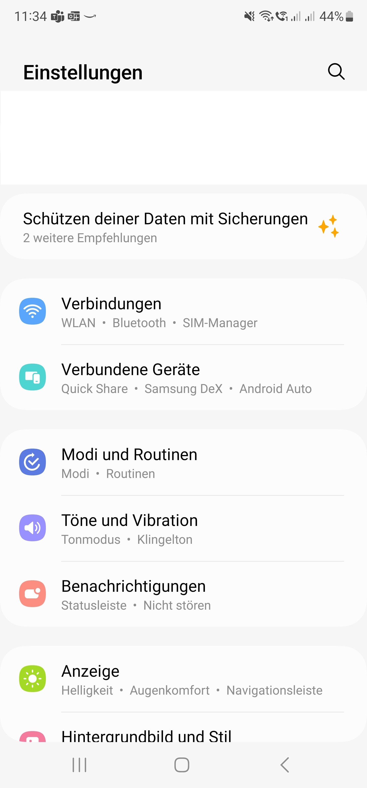
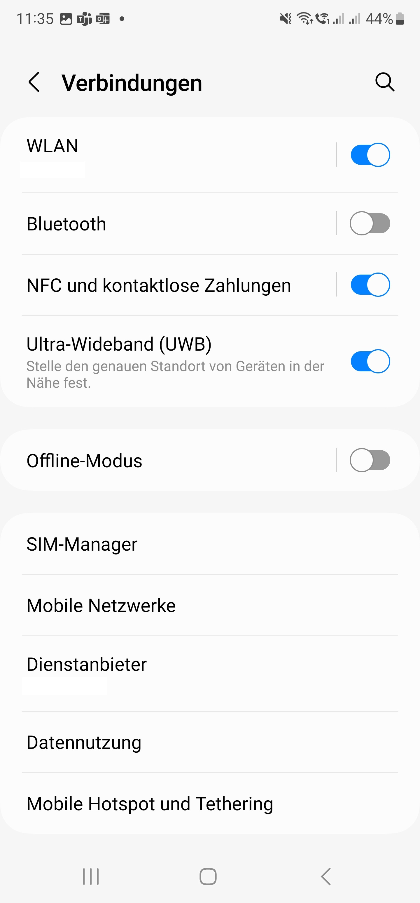
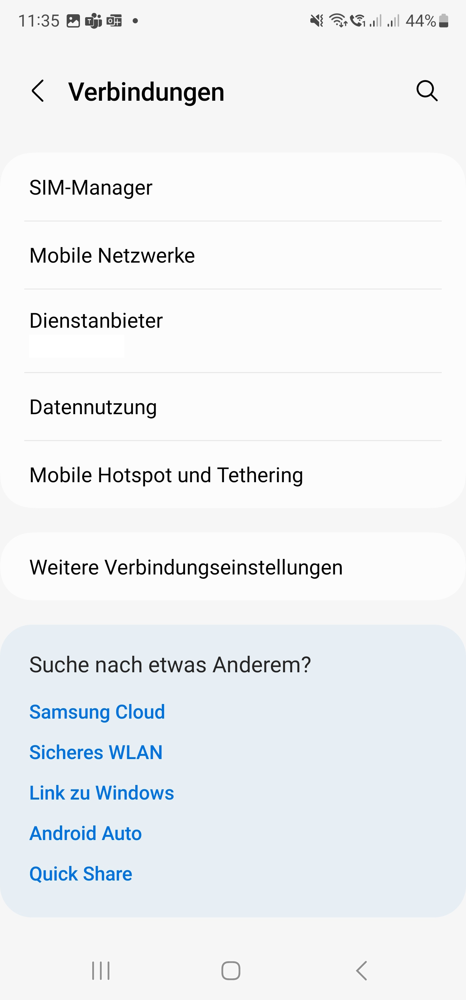
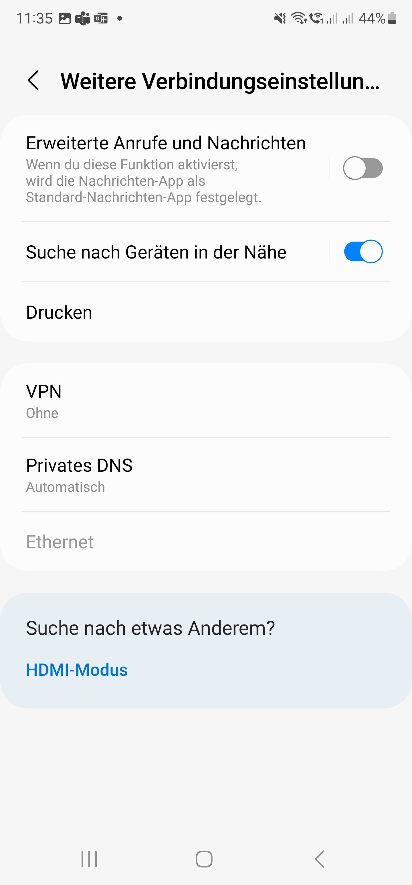
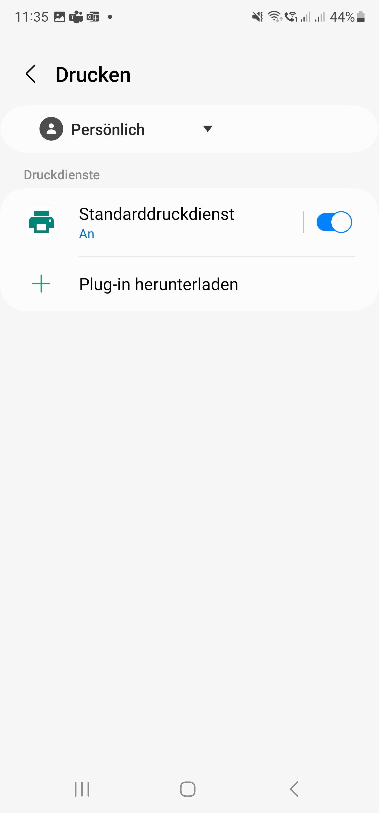
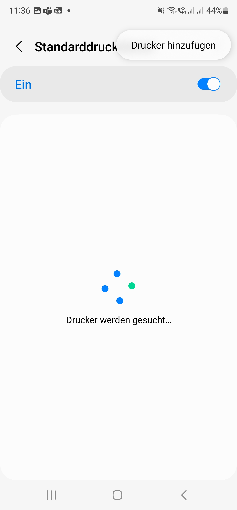

# MB2130-Docker


## Description
This docker container host a cups installation based on ubuntu:xenial.
It includes the driver for the Panasonic KX-MB2130G and a cups configuration for this printer.

The motivation for this container was due to two facts:
- the Windows driver doesn't work on Windows 11 any longer, due to problems with the driver signing.
- Android devices are not capable of using the printer with the Windows driver.

Both points are solved with this driver distribution.

The current version can be pullerd from hub.docker.com:

```shell
docker pull darkmessiah/ubuntu:qus1
```

## Container Execution

To run this container, the cups port 631 has to be exposed:

```shell
docker run -p "631:631" darkmessiah/ubuntu:qus1
```

You can also use docker-compose to run with the attached docker-compose.yml file:

```shell
docker-compose up -d
```

### Note

Since this image is x86_64 only due to the driver binaries, it can't be run on other architectures.
However there is a possibility to run it on a RaspberryPi 4 linux/arm/v7 with the help of qemu.

To do so, you need to install the qemu user files and register them for the image target architecture x86_64:

```shell
sudo docker run --rm --privileged aptman/qus:d7.2 -s -- -p x86_64
```

As now now it worked with the LATEST version tag d7.2.
With earlier version a saw segmentation faults/dumps due to errors in the binary cups filter.
This seems to be fixed now. 

I tested it on "Docker version 23.0.4, build f480fb1"

When you now run the image, it gives you a warning:

WARNING: The requested image's platform (linux/amd64) does not match the detected host platform (linux/arm/v7) and no specific platform was requested

Once you step into the container:

```shell
pi@raspberrypi:~/docker $ docker exec -it c8f4f46c83b3 bash
```

you can see, that the binaries are not executed directly, but with the qemu-x86_64-static

```shell
root@c8f4f46c83b3:/# ps -ef
UID        PID  PPID  C STIME TTY          TIME CMD
root         1     0  0 09:51 ?        00:00:01 /qus/bin/qemu-x86_64-static /usr/sbin/cupsd -f
root        25     0 13 09:59 pts/0    00:00:00 /qus/bin/qemu-x86_64-static /bin/bash
root        42    25  0 09:59 ?        00:00:00 /bin/ps -ef
```
  
## Client configuration

To use this driver instance either in your Windows installation or on your Android device, please see the following part for configuration.

### Windows:

Start - "Printers & Scanners" - Add device - Add manually
"Add a printer using an IP Address or hostname"


Device type : "IPP Device"
Hostname or IP address: "http://<IP>:631/printers/a"


### Android:

Go to Settings



Go to Connections



Go to down to "Other settings"

 

Go to Print



Enable "standard print service", Tap on "standard print service", Select Burger-Menu "Add printer"



Select "+ Add printer via IP address", Put in adress "ipp://<IP>/printers/a"


Afterwards the printer is available in the print service

![Screenshot](doc/Android/Screenshot_20230421_114052_Settings.jpg
